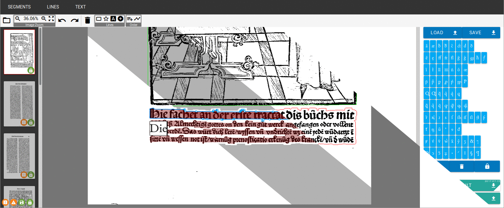

# LAREX

[](https://travis-ci.org/OCR4all/LAREX)

LAREX is a semi-automatic open-source tool for layout analysis on early printed books. 
It uses a rule based connected components approach which is very fast, 
easily comprehensible for the user and allows an intuitive manual correction if necessary. 
The PAGE XML format is used to support integration into existing OCR workflows. 
Evaluations showed that LAREX provides an efficient and flexible way to segment pages of early printed books.

Please feel free to visit the [tool homepage](https://go.uniwue.de/larex) and the [web application](http://www.larex-webapp.informatik.uni-wuerzburg.de/). A short user manual is available [here](http://www.is.informatik.uni-wuerzburg.de/fileadmin/10030600/Mitarbeiter/Reul_Christian/Projects/Layout_Analysis/LAREX_Quick_Guide.pdf).

## Table of Contents
- [Installation](#installation)
  * [Linux](#linux)
  * [Windows](#windows)
  * [Mac OS X](#mac-os-x)
- [Usage](#usage)
- [Configuration](#configuration)
- [Related Publications](#related-publications)

_Additional information about developing for LAREX [see here](documentation/development.md)_

## Installation

### Linux
This guide uses Tomcat 8, **Java 8** and Ubuntu (please adjust accordingly for your setup)

* Install required packages: 
	`apt-get install tomcat8 maven openjdk-8-jdk`
* Clone Repository: 
	`git clone https://github.com/OCR4all/LAREX.git`
* Compile: 
	`mvn clean install -f LAREX/pom.xml`.
* Copy or link the created war file to Tomcat:
	* Copy `cp LAREX/target/Larex.war /var/lib/tomcat8/webapps/Larex.war`
	* Link: `sudo ln -s $PWD/LAREX/target/Larex.war /var/lib/tomcat8/webapps/Larex.war`
* Start Tomcat:
	`systemctl start tomcat8`
	* (Restart Tomcat via `systemctl restart tomcat8`)
	* (To start Tomcat automatically at system boot `systemctl enable tomcat8`)

### Windows
This guide uses [Eclipse](https://www.eclipse.org/) to simplify the setup on Windows

* Install _Eclipse IDE for Enterprise Java Developers_ from the [official website](https://www.eclipse.org/downloads/packages/)
* Download Tomcat 8 or up from the [official website](http://tomcat.apache.org/download-90.cgi)
* Create a Tomcat server in eclipse:
	* Open `Window` -> `Show View` -> `Other...` -> `Server` -> `Servers`
	* Click prompt to add a new server, select `Apache` -> `Tomcat <version> Server` -> `Next`-> set your Tomcat installation directory -> `Finish`.
* Clone Repository:
	* `File` -> `Import` -> `Git` -> `Projects from Git` -> `Clone URI`
	-> Set `URI: https://github.com/OCR4all/LAREX.git` -> `[✓] master` -> `Next >` -> `Next >` -> `Import as gernal project` -> `Finish`
* Set as Maven Project:
* Import Project
	* Right click on `Larex` -> `Configure` -> `Convert to Maven Project` -> `Finish`
* Update maven project (if not updated automatically)
	* Rightclick on `Larex` -> `Maven` -> `Update Project...` -> `OK`
* Start Larex
	* Right click on `Larex` -> `Run As` -> `Run on Server`.

### Mac OS X
This guid uses homebrew (please adjust accordingly for your setup)
* Install Homebrew (see https://brew.sh/).
* Install required packages:
	* `brew cask install java`
	* `brew install tomcat git maven`
* (Verify Tomcat installation):
	* `brew services list` tomcat should be listed in the output of this command
* Clone Repository:
	* `git clone https://github.com/OCR4all/LAREX.git`
* Compile:
	* run `mvn clean install -f LAREX/pom.xml`.
* Copy or link the created war file to Tomcat
	* Copy: `cp LAREX/target/Larex.war /usr/local/Cellar/tomcat/[version]/libexec/webapps/Larex.war`
	* Link: `ln -s $PWD/LAREX/target/Larex.war /usr/local/Cellar/tomcat/[version]/libexec/webapps/Larex.war`
* Start Tomcat:
	* `brew services start tomcat`
	* (Restart Tomcat via `brew services restart tomcat`)


## Usage

### Access in browser
Go to `localhost:8080/Larex`.

### Using your own images and books
You can add your own books by copying them to `src/webapp/resources/books`

(Or an alternative direction set in the [config file](https://github.com/OCR4all/LAREX/blob/master/src/main/webapp/WEB-INF/larex.config). See section [*Configuration*](#configuration) for more information).

Book directories must have the following structure:
```
bookDir/
├── <book_name>/ 
│    ├── <page_name>.png 
│    └── <page_name>.xml
└── <book2_name>/
     └── …
```
### More information
Detailed information about the usage of LAREX can be found in the OCR4all [getting started](https://github.com/OCR4all/getting_started) guides.

See sections and chapters about _Segmentation_, _Ground Truth Correction_ and _Post Correction_.

## Configuration ##
LAREX contains a configuration file ([`src/webapp/WEB-INF/larex.config`](https://github.com/OCR4all/LAREX/blob/master/src/main/webapp/WEB-INF/larex.config)) with a few settings that can be set before running the application.

### bookpath ###
The setting *bookpath* sets the file path of the books folder.

e.g. `bookpath:/home/user/books` (Linux)

e.g. `bookpath:C:\Users\user\Documents\books` (Windows)

LAREX will load the books from this folder.

[default <Larex>/src/main/webapp/resources/books]

### localsave ###
The setting *localsave* tells the application how to handle results locally when saved.

`<mode>=[bookpath|savedir|none]`

`bookpath`: save the result in the bookpath

`savedir`: save the result in a defined savedir

`none`: do not save the result locally [default]

e.g. `localsave:bookpath`

### savedir ###
The setting *savedir* is needed if localsave mode is set to "savedir".

e.g. `savedir:/home/user/save` (Linux)

e.g. `savedir:C:\Users\user\Documents\save` (Windows)

### websave ###
The setting *websave* tells the application how to handle results on the browser side when saved.

`<value>=[true|false]`

`true`: download the result after saving [default]

`false`: no action after saving

e.g. `websave:true`

### modes ###
Set the accessible modes in the LAREX GUI `<value>=[[segment][edit][lines][text]]`
A combination of the modes "segment", "edit", "lines" and "text" can be set as 
a space separated string. 
e.g. `modes:segment lines`

The order of those modes in the string also determines which mode is opened
on startup, with the first in the list being opened as main mode.
The mode "segment" can be replaced with "edit" in order to hide all auto 
segmentation features. ("edit" will be ignored if both are present)

[Default] `modes:segment lines text`


### directrequest ###
This setting enables or disables the direct open feature.

`<value>=[enable|disable]`

This feature allows users to load a book from everywhere on the servers drive as well as to alter the options *websave*,  *localsave* and *savedir*.

`enable`: enable direct request

`disable`: disable direct request [default]

e.g. `directrequest:enable`

This feature should be used with caution but is very useful when using LAREX in a workflow with other web applications. (e.g. in Docker)

The easiest direct request would be via a html form with the values *bookpath*, *bookname*, *websave* (optional),  *localsave* (optional) and *savedir* (optional).
```html
<form action="http://localhost:8080/Larex/direct" method="POST">
	bookpath: <input type="text" name="bookpath"/><br>
	bookname: <input type="text" name="bookname"/><br>
	websave: <input type="text" name="websave"/><br>
	localsave: <input type="text" name="localsave"/><br>
	savedir: <input type="text" name="savedir"/><br>
	modes: <input type="text" name="modes"/><br>
	<input type="submit"/>
</form>
```

### OCR4all UI mode ###
This setting enables or disables OCR4all UI mode.

`<value>=[enable|disable]`

This setting allows displaying and/or hiding certain UI elements when LAREX is used in combination with OCR4all.

`enable`: enable OCR4all UI mode

`disable`: disable OCR4all UI mode [default]

e.g. `ocr4all:enable`


## Citing LAREX

If you are using LAREX please cite:

> Reul, C., Springmann, U., Puppe, F.: *Larex: A semi-automatic open-source tool for layout analysis and region extraction on early printed books* Proceedings of the 2nd International Conference on Digital Access to Textual Cultural Heritage (2017)
```
@inproceedings{reul2017larex,
  title={Larex: A semi-automatic open-source tool for layout analysis and region extraction on early printed books},
  author={Reul, Christian and Springmann, Uwe and Puppe, Frank},
  booktitle={Proceedings of the 2nd International Conference on Digital Access to Textual Cultural Heritage},
  pages={137--142},
  year={2017}
}
```
